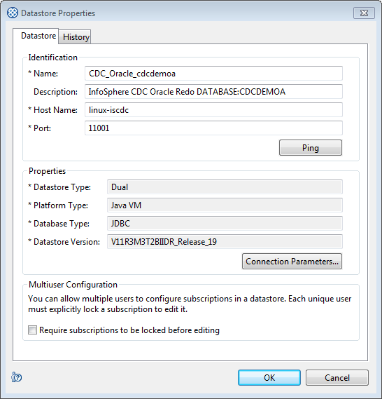
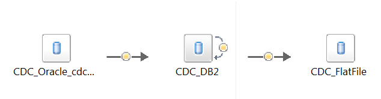
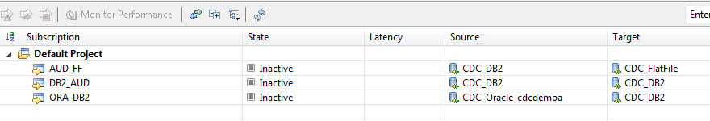
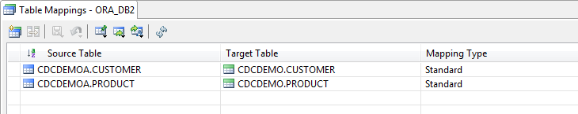
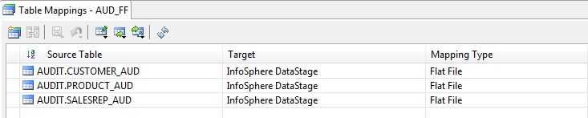
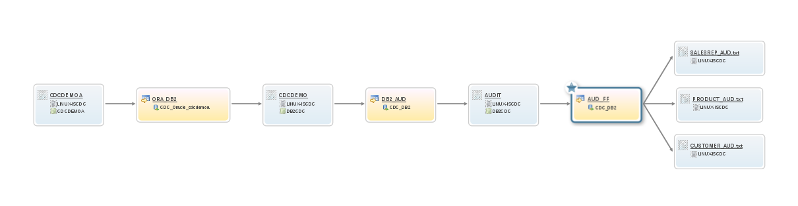

# IBM InfoSphere Data Replication CDC - Information Governance Catalog integration

In a world where businesses increasingly require timely access to current data before making business critical decisions, InfoSphere Data Replication facilitates the capturing and delivery of change data from the source systems on which it is located to the target systems and applications where it is required.

The change data is typically delivered to database tables, flat files or message queues in its original form, without transformation; this is typically referred to as "staging". From the "staging area", Extract-Transform-Load jobs, analytics and reporting tools  and other applications pick up the change data to drive business activities and decisions. In some cases, the path from the business application at the source to the target encompasses only a few steps, but more often there are many target systems requiring the change data and the original data has to be transformed to suit the receiving application or delivery vehicle.

IBM's InfoSphere Information Governance Catalog provides integration capabilities to understand and govern information in the entreprise and offers a unified catalog of assets for business users and technical staff. Initiatives such as information integration, lifecycle management, security and privacy can all be driven from the catalog and the metadata it holds. For example, if an asset such as a database table needs to be changed, one can perform an impact analysis. Or, if a business user questions the result of a certain key performance indicator, the catalog can be used to view the path from the source and the transformations that were performed, including data about when the data was last loaded.

This toolkit integrates the InfoSphere Data Replication CDC (CDC) metadata with the InfoSphere Information Governance Catalog. Data assets like source and target database tables and their columns are pushed to the catalog, along with information about the CDC subscription that replicates the tables. CDC metadata is extracted using the CHCCLP API that is provided as part of CDC's Management Console and Access Server and then the OpenIGC REST API is utilized to update the IGC assets.

## Installation
The GitHub repository contains all components required to run the ExportMetadata utility, including the Apache Commons and Log4j jar files. Besides the CDC Access Server or CDC Management Console, no further programs are needed. Classes have been compiled with Java 1.8, the version that comes with CDC Access Server 11.3.3. 

If you wish to use different versions of the included Apache projects, or use it with an older version of the CDC Access Server, please refer to the [Compilation](#compilation) section.

Download and unzip the master zip file from GitHub through the following link: [Download Zip](https://github.com/fketelaars/IIDR-IGC-Integration/archive/master.zip).

### Required software versions
There is a strong dependency of the CDC-IGC metadata integration utility on CDC Access Server (or Management Console) and the Information Governance Catalog. At a minimum, the following versions are required:
- CDC Engines: 10.2.0 and above (CHCCLP must be supported)
- CDC Access Server (or Management Console): 10.2.0 and higher (CHCCLP must be supported)
- Information Governance Catalog: 11.3 RU 16 and higher

## Configuration
In most scenarios you will need to perform two configuration tasks:
- Update the configuration properties
- Review the datastores and specify the database name

### Setting the configuration properties
Update the `conf/ExportMetadata.properties` file with your favourite editor and set the properties to reflect your environment. At a minimum, set the following properties:
* CDC\_AS\_HOME: Home (main) directory of the Access Server or Management Console. This directory must have a `lib` subdirectory that holds the CHCCLP jar files and a directory with the Java Runtime Engine that will be used for the utility. If your directory path contains blanks or other special characters, please enclose the path in double quotes (").
* asHostName: Host name or IP address of the server running the Access Server.
* asUserName: User name to connect to the Access Server.
* asPassword: Password for the Access Server user. Please specify the password in its readable format; when the utility runs it will automatically encrypt the password and update the property.
* isHostName: Host name or IP address of the server running the Information Governance Catalog.
* isUserName: User name to connect to the Information Governance Catalog REST interface.
* isPassword: Password for the IGC. Please specify the password in its readable format; when the utility runs it will automatically encrypt the password and update the property.

### Review the datastores and specify the database name
When registering table assets in the Information Governance Catalog, you must specify the hostname, database name, schema name and table name. In most cases the hostname specified in the datastore definition will reflect the server that runs the database, but the datastore does not expose the name of the database.

If the name of the database matches the name of the datastore, you don't need to do anything. However, to overrule the name of the database, specify the name in the datastore description, prefixing it with "DATABASE:" or "DB:". Example:

 
 

## Usage
Once the tool has been configured, you can perform the export of the metadata using the shell/command script that is provided in the utility's home directory.

* Linux/Unix: `ExportMetadata.sh -ds <source datastore> [-s subscription(s)] [-p] [-ub] [-xp] [-d]`

* Windows: `ExportMetadata.cmd -ds <source datastore> [-s subscription(s)] [-p] [-ub] [-xp] [-d]`

### Parameters
- ds: Specifies the source datastore of the subscriptons you wish to export.
- s: Optional. Specifies which subscriptions you wish to export. Multiple subscriptions can be specified, separated by commas. If you do not specify this parameter, all subscriptions sourcing the specified datastore are exported.
- p: Optional. If specified, the export to the Information Governance Catalog is not performed, but the utility only generates a "preview" file in the data directory specified in the configuration properties. The name of the file is `<datastore>_ExportMetadata_Preview.txt`
- ub: Optional. Updates the IIDR bundle in the Information Governance Catalog. If the bundle has not been imported yet, it is automatically uploaded the first time you run the utility. This parameter is only needed if a new version of the utility is installed and the bundle has been updated.
- xp: Optional. For debugging, also exports the xml data that will be sent to the Information Governance Catalog using the OpenIGC API.
- d: Optional. Displays debug messages for troubleshooting.

### Command example
`ExportMetadata.sh -ds CDC_DB2 -s S1,S2,S3`

The command connects to the Access Server and then the CDC_DB2 datastore. Subsequently, it retrieves the table and column mappings of subscriptions S1, S2 and S3 and then exports them to the Information Governance Catalog.

## Example
In the following example, we have set up CDC to replicate 2 tables (CDCDEMOA.CUSTOMER and CDCDEMOA.PRODUCT) from Oracle to DB2 (schema CDCDEMO) with Standard mapping type. From the DB2 target tables, another subscription replicates the 2 tables and 1 additional table (SALESREP) to a different DB2 schema, AUDIT, using Audit mapping type. From the AUDIT schema, the changes are replicated to flat files using the CDC for Datastage engine.

The topology is as follows:

And these are the subscriptions carrying out the replication tasks:

 

The replicated tables in each of the subscriptions:

In the above configuration, we need to collect metadata for 2 source datastores, CDC\_Oracle\_cdcdemoa and CDC\_DB2. For the CDC\_Oracle\_cdcdemoa datastore, the utility will collect the definition of 1 subscription; for the CDC\_DB2 datastore, it will collect metadata for 2 subscriptions, one replicating to the same target and one replicating to flat files.

The commands to be run are:
`ExportMetadata.sh -ds CDC_Oracle_cdcdemoa`

and

`ExportMetadata.sh -ds CDC_DB2`

Here is an example of the output generated when run for the CDC\_DB2 datastore.

    2016-05-12 19:12:55 INFO  Version: 1.0.28, date: 2016-05-12_10.18.45_CEST
    2016-05-12 19:12:56 INFO  Connecting to Access Server at host name tirnanog and port 10101
    2016-05-12 19:12:56 INFO  Listing subscriptions for datastore CDC_DB2
    2016-05-12 19:12:59 INFO  Getting rule sets for subscription DB2_AUD
    2016-05-12 19:12:59 INFO  Posting assets to Information Governance Catalog on troia
    2016-05-12 19:13:00 INFO  Posting flows to Information Governance Catalog on troia
    2016-05-12 19:13:00 INFO  Finished exporting the CDC metadata

And this is the resulting lineage.

## Compilation
If you wish to build the tookit yourself, the easiest method is to use Ant ([https://ant.apache.org/bindownload.cgi](https://ant.apache.org/bindownload.cgi)). 

Once you have this installed:
- Optionally, download new versions of the Apache libraries which are included under `opt/downloaded`
- Ensure that the ant executable is in the path
- Go to the directory where you unzipped the user exit master file
- Update the `CDC_AS_HOME` property in the `ExportMetadata.properties` file to match the location where you installed the CDC Access Server
- Run `ant`
- First the sources will be compiled into their respective .class files and finally the class files are packaged into a jar 

